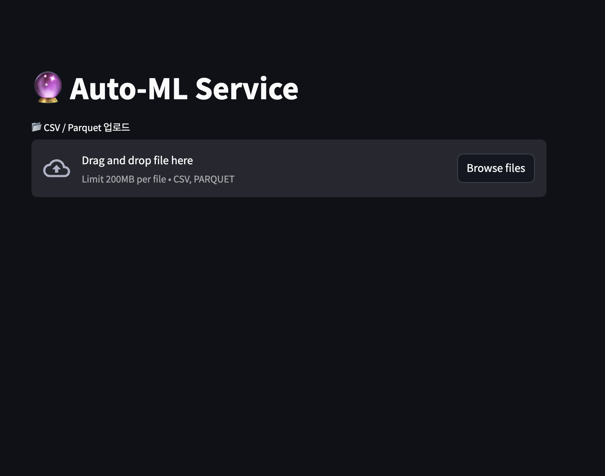

# 🚀 User-Friendly AutoML Program for Everyone

## 1. 🌟 Overview

**🎬 Demo Video:**  
[▶️ Watch on YouTube](https://youtu.be/rONjcUmTDWk)

This project is an **all-in-one AutoML platform** designed for everyone—from beginners to professional data scientists.  
By simply uploading tabular data (CSV, Excel, etc.) through a web interface,  
the platform automatically detects the task type (**Regression / Classification / Time Series**),  
performs **EDA**, preprocessing, feature engineering, model selection/tuning, evaluation, and XAI-based interpretation—  
**all in a single click, without any coding required.**

- ✅ **Fully Automated:** End-to-end pipeline from preprocessing to modeling and reporting, triggered by data upload  
- ✅ **User-Friendly:** Intuitive web UI built with Streamlit  
- ✅ **Production-Grade Quality:** Diverse models and algorithms, advanced preprocessing, built-in XAI (explainable AI) support  
- ✅ **Versatility:** Supports classification, regression, and time series forecasting  
- ✅ **Portfolio & Industry Ready:** Ideal for data science internship/job portfolios in the U.S., and practical for real-world business applications  

---

## 2. ✨ Key Features

- **Fully Automated Machine Learning Pipeline**  
  End-to-end automation: just upload your data and receive automatic exploratory data analysis (EDA), preprocessing, feature engineering, model selection and hyperparameter tuning, evaluation, and report generation.

- **Multi-Task Support**  
  - Regression
  - Classification
  - Time Series Forecasting  
  Automatically detects the problem type and applies the optimal pipeline accordingly.

- **User-Friendly Web Interface**  
  Built with Streamlit for an intuitive web UI—no coding skills required. Anyone can use it right away.

- **Advanced Explainable AI (XAI) Tools**  
  Includes SHAP, Permutation Importance, and more for model interpretation and transparency.

- **Integrated State-of-the-Art Algorithms**  
  Supports LightGBM, XGBoost, RandomForest, Ridge, Lasso, and several time series models. Models and hyperparameters are automatically selected for best performance.

- **Comprehensive Reporting & Download**  
  Generates a complete HTML report including analysis, model performance, and key insights—ready to download and share.

---

## 3. 🗂️ Project Structure

├── app.py                       # Main Streamlit web app
├── requirements.txt             # Python package requirements
├── README.md                    # Project overview and instructions
├── automl/
│   ├── init.py
│   ├── io.py                    # Data loading and utility functions
│   ├── detector.py              # Automatic problem type detection
│   ├── regression/
│   │   ├── eda.py
│   │   ├── preprocessing.py
│   │   ├── model_search.py
│   │   ├── evaluation.py
│   │   └── report.py
│   ├── classification/
│   │   ├── eda.py
│   │   ├── preprocessing.py
│   │   ├── model_search.py
│   │   ├── evaluation.py
│   │   └── report.py
│   └── timeseries/
│       ├── eda.py
│       ├── preprocessing.py
│       ├── model_search.py
│       ├── evaluation.py
│       └── report.py
└── (Other data and report files)

> For detailed explanations of each folder and file, see the following "Project Structure" section below.

---

## 4. ⚙️ Tech Stack

- **Python 3.8+**  
- **Streamlit**: User-friendly web UI for interaction
- **pandas, numpy**: Data processing and analysis
- **scikit-learn**: Preprocessing, modeling, and hyperparameter tuning
- **imblearn**: Class imbalance handling (SMOTE, etc.)
- **lightgbm, xgboost**: High-performance machine learning algorithms
- **statsmodels**: Time series analysis and statistical functions
- **ydata-profiling**: Automated data profiling & EDA
- **matplotlib, seaborn**: Data visualization
- **shap**: Model interpretation & explainability (XAI)

---

## 5. 🚀 Installation & Getting Started

1. **Clone the repository**
    ```bash
    git clone https://github.com/Marcus-Son/Auto-ML-Service-Using-Open-Source.git
    cd your-repo
    ```

2. **(Optional) Create virtual environment & install dependencies**
    ```bash
    python -m venv venv
    source venv/bin/activate  # (Windows: venv\Scripts\activate)
    pip install -r requirements.txt
    ```

3. **Run the Streamlit app**
    ```bash
    streamlit run app.py
    ```

4. **Access the app in your browser**  
   Open the prompted local address (e.g., `http://localhost:8501`) and start by uploading your data file.

---

## 6. 📋 How To Use

1. **Upload your dataset (CSV or Parquet) via the web UI**
2. **Select the target column (and time column for time series tasks)**
3. **Review automated EDA results, then proceed through preprocessing, modeling, and report generation**
4. **Download the comprehensive HTML analysis report for your records or presentations**


## 6.1. Sample Datasets Included

This repository includes several **real-world datasets** (see `dataset/` folder) for quick experimentation and demonstration:

dataset/
├── classification/
│     ├── faults.csv
│     └── Titanic-Dataset.csv
├── regression/
│     ├── AmesHousing.csv
│     └── bodyfat_missing.csv
└── timeseries/
├── 1_Daily_minimum_temperatures.csv
├── COMED_hourly.csv
└── monthly_champagne_sales.csv

- **Classification:** Use `faults.csv` or `Titanic-Dataset.csv` for binary/multiclass classification examples.
- **Regression:** Try `AmesHousing.csv` (house price prediction) or `bodyfat_missing.csv` for regression tasks.
- **Time Series:** Use `1_Daily_minimum_temperatures.csv`, `COMED_hourly.csv`, or `monthly_champagne_sales.csv` for time series forecasting.

You can directly upload these datasets through the web UI to explore the automated pipeline and see how the platform works on different problem types.

---

## 7. 🔄 Automation Pipeline Details

This project fully automates every essential step of the data science pipeline. Once a user uploads their data, the following processes run automatically:

### • Automated EDA

- Automatically visualizes and reports key statistics, including data distribution, missing values, outliers, and feature summaries.
- Provides customized diagnostics for classification, regression, and time series tasks.

### • Preprocessing & Feature Engineering

- Handles missing values, detects and processes outliers, applies scaling and encoding—all with no manual intervention.
- For time series data, automatically creates time-based features (lag, rolling mean, etc.).
- Performs tailored feature engineering for categorical, numerical, and time series data types.

### • Model Search & Leaderboard

- Conducts automated hyperparameter tuning and performance evaluation across multiple algorithms (e.g., LightGBM, XGBoost, Ridge, Logistic Regression, etc.).
- Provides a leaderboard with the best-performing models and key candidate models for transparent comparison.

### • XAI & Reporting

- Applies Explainable AI (XAI) techniques such as SHAP and Permutation Importance to visualize prediction results and feature influences.
- Automatically generates a comprehensive HTML report, summarizing the full process, evaluation metrics, and key insights.

---

## 8. 📊 Sample Output & Results

- This project automates the entire data science workflow: from data upload and EDA to preprocessing, modeling, evaluation, explainability (XAI), and automated report generation.
- Below are sample outputs and screenshots from a real execution of the application.

### 1) End-to-End Analysis Workflow Example
- Data upload (e.g., CSV or Parquet file)
- Target/Time column selection and automatic task type detection
- Automated EDA, including data distribution, outlier, and trend/seasonality visualization
- Preprocessing (missing values, encoding, scaling, feature engineering) with auto-generated logs
- Model search and leaderboard with cross-validation
- Explainability: Feature importance and SHAP-based insights
- Automated HTML report download

### 2) Sample Report Screenshots

**(1) Data Upload & Task Type Detection**
- 
  - *Description: Shows the user interface for uploading files and selecting target/time columns.*

**(2) EDA Visualizations**
- 
- 
- 
- 
- 
- 
- 
  - *Description: Automated plots for target distribution, trend/seasonality, outlier detection, etc.*

**(3) Preprocessing Logs**
- 
  - *Description: Shows log messages and data preview after automated preprocessing.*

**(4) Model Leaderboard**
- 
  - *Description: Displays ranked models with metrics and best hyperparameters.*

**(5) Explainability (Feature Importance & SHAP)**
- 
- 
- 
- 
  - *Description: Visualizes feature impact on predictions using SHAP.*

**(6) Report Download**
- 
  - *Description: Interface for downloading the generated HTML report.*

**(7) Example Excerpt from HTML Report**
- 
- 
  - *Description: Excerpt from the auto-generated report, including performance metrics, plots, and XAI explanations.*

> *Tip: You can use actual screenshots from your application and save them in the `images/` directory. Replace the file names in the Markdown above with your actual screenshot filenames.*

---

## 9. 💼 Career/Portfolio Highlights

### Key Strengths & Differentiators

- **Fully Automated AutoML Pipeline:** From raw data upload to EDA, preprocessing, modeling, evaluation, explainability, and report generation—all steps are seamlessly automated, mimicking real-world data science workflows.
- **Supports All Major Problem Types:** Handles classification, regression, and time series forecasting—covering the most common business analytics scenarios.
- **Robust Data Handling:** Automatically detects and processes missing values, outliers, categorical/numerical data, time formats, and irregularities—ensuring reliability on real, messy datasets.
- **Built-in Model Explainability:** Automatically generates model interpretation results (e.g., SHAP, feature importance), providing practical, actionable insights for business decision-making.
- **User-Friendly Web GUI:** Enables non-technical stakeholders (e.g., business analysts, product managers) to run sophisticated analyses without coding, making it ideal for collaborative environments.
- **Scalable & Modular Codebase:** Clean, well-documented, and modular Python code—ready for extension or integration into larger production systems.
- **State-of-the-Art Tech Stack:** Implements modern best practices in machine learning, AutoML, and explainable AI, fully aligned with industry and research standards.

### Why This Project Stands Out

- **End-to-End Workflow Automation:** No manual steps required—just upload your data and get a complete, human-readable report with insights and visualizations.
- **Portfolio-Ready Demonstration:** All code, logs, and example reports can be showcased directly in interviews or online portfolios (e.g., GitHub), making your skills visible and concrete.
- **Kaggle and Industry Benchmark Alignment:** Reflects patterns and standards from top data competitions and real business use cases.
- **Easy Customization:** Designed for quick adaptation to new datasets, domains, and business questions—ideal for practical consulting or rapid prototyping.
- **Perfect for Job Applications:** Shows mastery of not just modeling, but also automation, clean code, explainability, and UX—all highly valued in U.S. data science roles.

---

## 10. 🤝 Contributing

- Everyone is welcome to contribute to this project!
- All forms of contribution are appreciated, including bug reports, feature suggestions, documentation, and code improvements.
- Please open an [Issue](https://github.com/Marcus-Son/Auto-ML-Service-Using-Open-Source/issues) to discuss any ideas or problems before submitting a PR.
- When submitting a Pull Request, include a brief explanation of your changes and, if possible, add tests.
- Please follow the code style and structure as closely as possible, and update documentation or comments as needed.

---

## 11. ❓ Frequently Asked Questions (FAQ)

**Q. Do I need a Python environment to use this project?**  
A. Yes, this AutoML platform requires Python (>=3.8). All dependencies are listed in `requirements.txt`.

**Q. Can I use it for non-time-series datasets?**  
A. Absolutely! The tool supports classification, regression, and time-series forecasting.

**Q. Can I upload large datasets through the web interface?**  
A. For very large datasets (e.g., over 100,000 rows), some EDA steps will use sampling to improve speed and stability.

**Q. Can I add my own models or customize hyperparameters?**  
A. Yes, the modular codebase allows easy extension—just edit the relevant scripts to add models or change pipelines.

---

## 12. 📜 License

- This project is licensed under the [MIT License](./LICENSE).
- You are free to use, modify, and distribute this software for both commercial and non-commercial purposes.
- Please review the full license terms in the LICENSE file.

---

## 13. ⚠️ Limitations & Disclaimer

- **Scope:**  
  This AutoML platform is optimized for **tabular (structured) data**. It is not designed for image, text (NLP), or raw unstructured data.
- **Large Datasets:**  
  For very large files (over 100,000 rows), certain EDA and model search steps may use sampling or be slower depending on your hardware.
- **Real-Time & Streaming:**  
  The system is intended for **batch/analysis workflows**, not for real-time or streaming inference.
- **Model Coverage:**  
  This platform covers major algorithms for classification, regression, and time series, but does **not** include deep learning or specialized time series architectures (e.g., LSTM, Prophet).
- **Custom Extensions:**  
  If you need more advanced model types or integrations, the codebase is modular for your own extension.
- **Disclaimer:**  
  This software is provided as-is for learning and rapid prototyping; for high-stakes or production deployments, further validation and security reviews are advised. 
